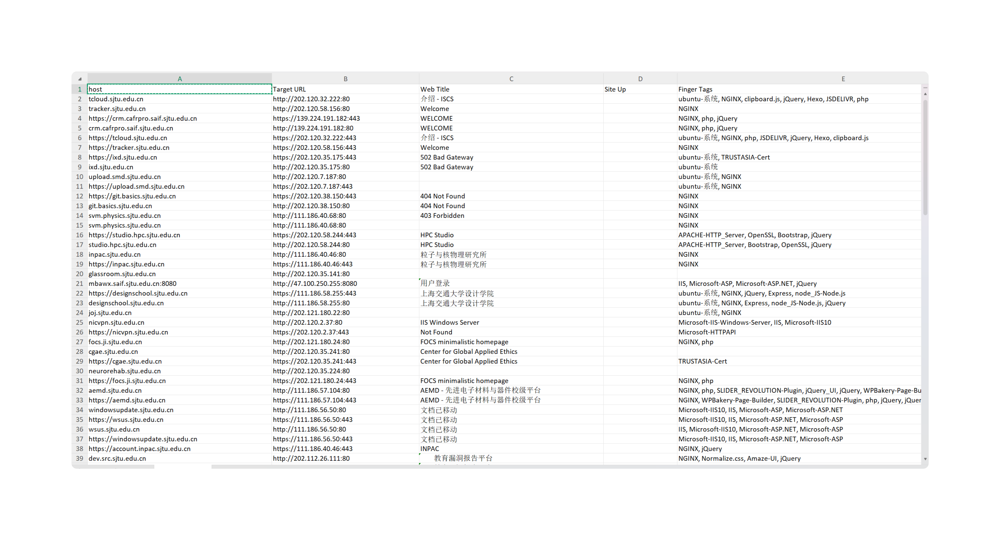

<h3 align="center">P1finger 一款红队行动下的重点资产指纹识别工具</h3>


# 功能特色

* P1finger 支持两种指纹识别模式：

  1. 基于P1finger本地规则库的Web指纹识别

  2. 基于Fofa测绘系统的Web指纹识别
* Yaml文件模块化的指纹库，高度支持客制化，方便自定义指纹库使用
* 支持`Excel`表格和`Json`格式导出，便于数据的二次处理
* 支持 http / socks代理使用

在线体验地址：http://p1finger.securapath.org （在线版后端更新慢，建议下载Github Release版本）

打造P1finger红队模式指纹公开收集表格：[P1finger红队版 -- 红队攻防中的重点资产系统](https://gngefq8qwm.feishu.cn/wiki/DF7iwvUtmiSpqEkr1ntcNL5fnMc?from=from_copylink)

P1finger 指纹库：[P001water/P1finger-Fingerprints: P1finger - 指纹库和技术文档](https://github.com/P001water/P1finger-Fingerprints)

## Version

当前最新版本 `v0.1.1` （2025/5/10更新）[更新日志参见](https://github.com/P001water/P1finger/blob/master/更新日志.md)

---

## 首次运行配置

P1finger在命令行下首次运行生成 `p1fingerConf.yaml` 配置文件，在配置文件中填上 `email` 和 `key` 即可。

生成的配置文件内容如下

```yaml
CustomizeFingerFiles: [] 			// 自定义的指纹文件
UseDefaultFingerFils: false			// 自定义指纹库后是否还加入默认的指纹库
FofaCredentials: 				    // Fofa Api凭证
    Email: P001water@163.com
    ApiKey: xxxx
```

## 开始使用

```
Usage:

  P1finger [command]


Available Commands:

  finger       Operations on the P1finger fingerprint database
  fofa         基于Fofa空间测绘引擎的指纹识别
  help         Help about any command
  rule         基于P1finger本地指纹库的指纹识别
  upgrade      self upgrade
  version      Print the P1finger Version


Flags:

      --debug           http debug info, eg:[-debug]
  -h, --help            help for P1finger
  -o, --output string   output file name: [-o p1finger.xlsx] / [-o p1finger.json] (default "p1finger.json")
  -p, --proxy string    proxy eg: [--proxy socks5://127.0.0.1]
```


## 使用示例

* 基于本地规则库模式使用

使用 `rule` 命令，指定参数

```
P1finger rule -u [target]
P1finger rule -f [target file] // -uf 指定url文件

[-rate 500 可控制协程数量，默认值为500]
```


* 基于fofa的采集模式使用

使用`fofa`命令切换到Fofa模式，

```
P1finger fofa -u [target]
P1finger fofa -f [target file]
```



* 输出到`Excel`表格和`Json`格式文件

 设置`-o`参数可自定义输出文件名，支持`json`和`excel表格`模式，同时支持 `rule`和`fofa`模式

```
P1finger fofa -f [target file] -o file.xlsx // file.xlsx可自定义文件名
```

* 代理模式使用

socks5 代理

```
P1finger.exe rule -f urls.txt --proxy socks5://127.0.0.1:8911
```

http 代理

```
P1finger.exe rule -f urls.txt --proxy http://127.0.0.1:8910
```

* 自定义指纹库使用

如下表示，在配置文件中配置自定义的`redteam.yaml`指纹库文件。`UseDefaultFingerFils`表示自定义指纹库的情况下，是否还带上默认的指纹库

```
CustomizeFingerFiles:
  - redteam.yaml
UseDefaultFingerFils: true
```

## 指纹库规则和如何贡献指纹

详情参考：[指纹库规范 - 安全漫道.team Wiki](https://securapath.github.io/SecuraPathWiki/P1finger/fingersRepo/)

# 致谢

感谢社区已有的指纹库和整合指纹库做出努力的作者们，P1finger的指纹库在这些巨人的肩膀上建立

* [0x727/FingerprintHub](https://github.com/0x727/FingerprintHub)
* [chainreactors/spray](https://github.com/chainreactors/spray)

