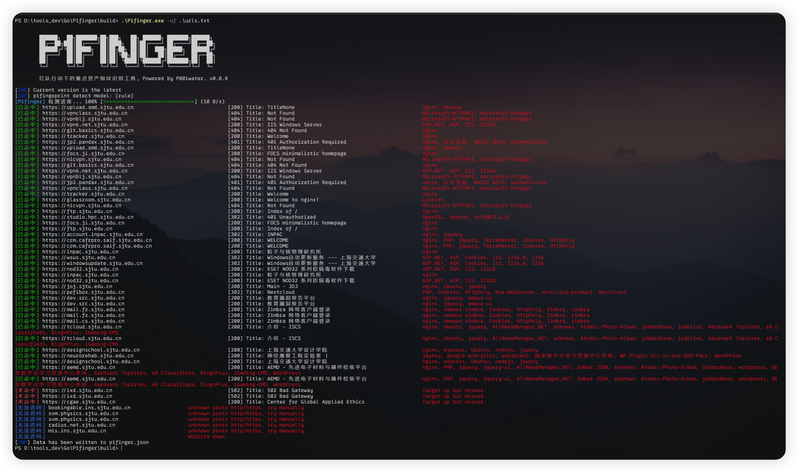
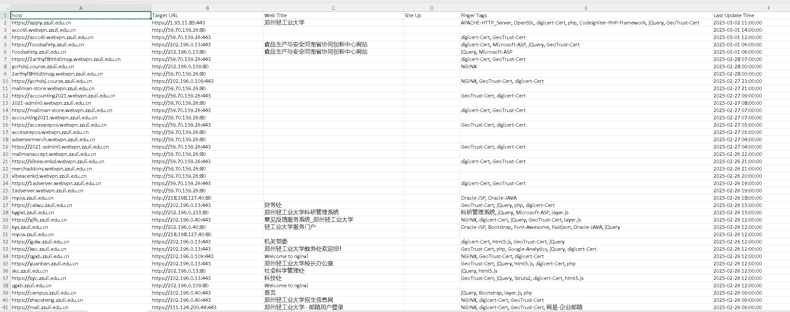

<h3 align="center">P1finger 一款红队行动下的重点资产指纹识别工具</h3>


# 功能特色

* P1finger `v0.0.4` 版本开始支持两种指纹识别模式

  1. 基于本地规则库的重点资产指纹识别

  1. 基于Fofa测绘系统的web指纹识别


* 支持excel表格和json格式输出
* 支持 http / socks代理使用

在线体验地址：http://p1finger.securapath.org


## Version

当前最新 `beta_version v0.0.8` （2025/3/24更新）[更新日志参见](https://github.com/P001water/P1finger/blob/master/更新日志.md)

---

# 基本使用

## 配置Fofa key

P1finger在命令行下首次运行生成 `p1fingerConf.yaml` 配置文件，在配置文件中填上 `email` 和 `key` 即可。

文件内容参考

```
FofaCredentials:
    Email: P001water@163.com
    ApiKey: xxxx
```


## 开始使用

`-m` 参数切换模式，

1. `-m rule` 基于本地规则库模式，（默认模式）
2. `-m fofa` 基于fofa的采集模式，（手动开启）

基于本地规则库模式使用

```
P1finger -u [target]
P1finger -uf [target file] //-uf 指定url文件
```



基于fofa的采集模式

`-o` 可自定义输出文件名，支持`json`和`excel表格`模式

```
P1finger -m fofa -u [target]
P1finger -m fofa -uf [target file] -o file.xlsx // file.xlsx可自定义文件名
```




3. socks5 代理

```
P1finger.exe -uf urls.txt -socks 127.0.0.1:4781
```

4. http 代理

```
P1finger.exe -uf urls.txt -httpproxy 127.0.0.1:4781
```


